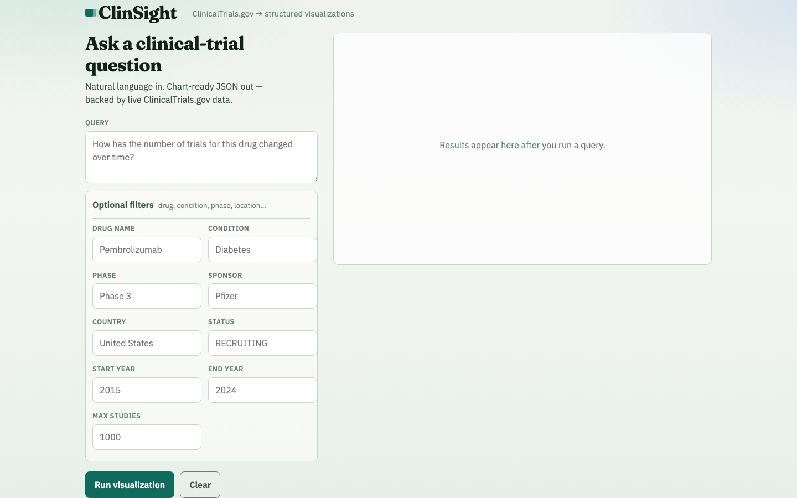
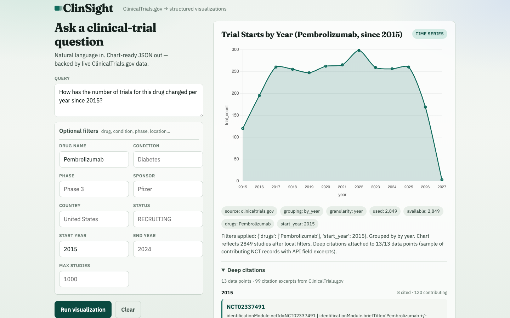
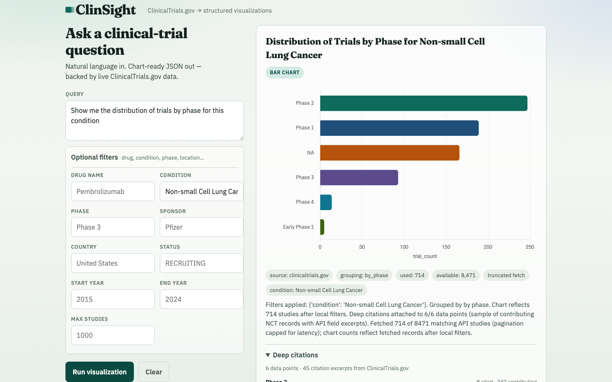
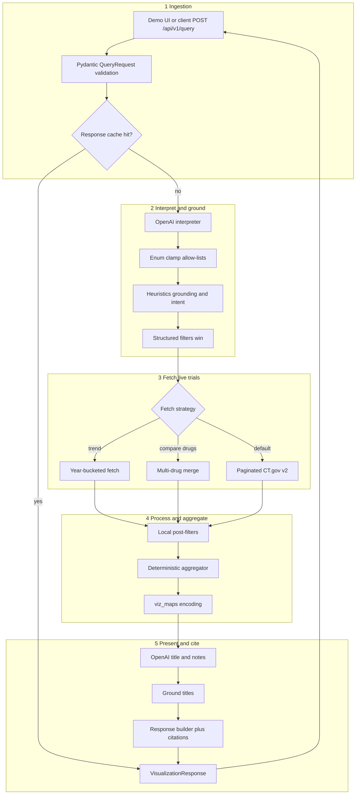

# ClinSight Agent

ClinSight Agent turns natural-language questions about clinical trials into **chart-ready JSON** a frontend can render immediately.

Ask things like “Pembrolizumab trials by year since 2015” or “which sponsors lead diabetes studies?” and the service returns a typed visualization (`time_series`, `bar_chart`, `pie_chart`, `network_graph`, and more) plus metadata and deep NCT citations.

**How it works:** live data comes from the [ClinicalTrials.gov API v2](https://clinicaltrials.gov/data-api/api). An LLM interprets the question and writes titles/notes; **counts, groupings, and encodings are computed in code** so the model never invents bar heights. A small demo UI is included at `/`.

---

## Quick start

**Requirements:** Python 3.11+, OpenAI API key, a normal terminal (Terminal / PowerShell / CMD — not a Python REPL).

On Windows, use `python` (not `python3`) if `python3` is not found. Open the UI at **http://localhost:8000/** — do **not** open `http://0.0.0.0:8000/` (that bind address is not a browser URL).

### 1. Clone

```bash
git clone https://github.com/ShubhamRSY/ClinSight-Agent.git
cd ClinSight-Agent
```

### 2. Create & activate a virtualenv

**macOS / Linux**

```bash
python3 -m venv .venv
source .venv/bin/activate
```

**Windows (CMD)**

```bat
python -m venv .venv
.venv\Scripts\activate
```

**Windows (PowerShell)**

```powershell
python -m venv .venv
.venv\Scripts\Activate.ps1
```

If PowerShell blocks activation: `Set-ExecutionPolicy -Scope CurrentUser RemoteSigned`

### 3. Install

```bash
pip install -r requirements.txt
```

### 4. Configure

**Preferred (all platforms):** create a `.env` file in the repo root (never commit it):

```
OPENAI_API_KEY=sk-...
OPENAI_MODEL=gpt-4o-mini
```

**Or set env vars in the shell:**

| Platform | Commands |
|----------|----------|
| **macOS / Linux** | `export OPENAI_API_KEY="sk-..."` <br> `export OPENAI_MODEL="gpt-4o-mini"` |
| **Windows CMD** | `set OPENAI_API_KEY=sk-...` <br> `set OPENAI_MODEL=gpt-4o-mini` |
| **Windows PowerShell** | `$env:OPENAI_API_KEY="sk-..."` <br> `$env:OPENAI_MODEL="gpt-4o-mini"` |

Optional (reproducible “last N months” demos/tests): set `CLINSIGHT_REFERENCE_DATE=2026-07-29` the same way.

See [Environment variables](#environment-variables) for the full list.

### 5. Start

```bash
python main.py
```

Leave that terminal running. Then open a **browser**:

| URL | Purpose |
|-----|---------|
| **http://localhost:8000/** | Interactive demo UI |
| http://localhost:8000/docs | Swagger / OpenAPI |
| http://localhost:8000/health | Health check |
| `POST /api/v1/query` | Main API |

Demo UI: form + optional filters, Chart.js charts, SVG network graphs, deep citations, and raw JSON.

### 6. Open the demo video

From the repo root:

| Platform | Open demo folder |
|----------|------------------|
| **macOS** | `open docs/demo/` |
| **Linux** | `xdg-open docs/demo/` |
| **Windows** | `explorer docs\demo` |

| File | Path | Notes |
|------|------|-------|
| Demo video (MP4) | [`docs/demo/clinsight-demo.mp4`](docs/demo/clinsight-demo.mp4) | Small preview (~1 MB) — opens easily on GitHub |
| Demo recording (MOV) | [`docs/demo/clinsight-demo.mov`](docs/demo/clinsight-demo.mov) | Full screen recording with audio (~61 MB) — download and play locally |

Or open the folder locally (see commands above).

---

## Demo

Local UI at [http://localhost:8000/](http://localhost:8000/) after `python main.py`. No separate deploy required for grading — clone, configure the key, and run.

### Demo video

Short walkthrough (~4.5 min): time-series → phase bar chart → drug–sponsor network (and more in the recording).

- **Light preview:** [docs/demo/clinsight-demo.mp4](docs/demo/clinsight-demo.mp4)
- **Full recording + audio:** [docs/demo/clinsight-demo.mov](docs/demo/clinsight-demo.mov) (~61 MB — download and play in QuickTime/VLC)

### Screenshots

**1. Demo UI** — query composer, optional filters, example chips, and results panel



**2. Time-series result** — Pembrolizumab trial starts by year since 2015, with metadata and deep citations



**3. Categorical result** — NSCLC trials by phase (bar chart) with truncation honesty in `meta`



---

## Environment variables

| Variable | Default | Description |
|----------|---------|-------------|
| `OPENAI_API_KEY` | _(required)_ | OpenAI key for interpret + title/notes |
| `OPENAI_MODEL` | `gpt-4o-mini` | Chat Completions model |
| `CT_PAGE_SIZE` | `200` | CT.gov page size (1–1000) |
| `CT_MAX_STUDIES` | `1000` | Default fetch cap per query |
| `CT_TIMEOUT_SECONDS` | `45` | HTTP timeout |
| `CT_MAX_RETRIES` | `3` | Retries on 429/5xx (`Retry-After` honored) |
| `CT_PAGE_PAUSE_SECONDS` | `0.2` | Pause between CT.gov pages |
| `QUERY_CACHE_TTL_SECONDS` | `300` | In-process response cache TTL (`0` = off) |
| `QUERY_CACHE_MAX_ENTRIES` | `128` | Max cached responses (process-local) |
| `CLINSIGHT_REFERENCE_DATE` | _(today)_ | `YYYY-MM-DD` for relative time phrases |

---

## API

### `POST /api/v1/query`

| Field | Type | Required | Notes |
|-------|------|----------|-------|
| `query` | string | **Yes** | Natural-language question |
| `drug_name` | string | No | Intervention (`query.intr`) |
| `condition` | string | No | Disease (`query.cond`) |
| `trial_phase` | string | No | Aliases → `PHASE1`…`PHASE4` / `EARLY_PHASE1` / `NA` |
| `sponsor` | string | No | Lead sponsor (`query.lead` + local filter) |
| `country` | string | No | Location; aliases like `usa` → `United States` |
| `start_year` / `end_year` | int | No | 1900–2100 inclusive |
| `status` | string | No | CT.gov status / aliases; comma-lists allowed |
| `max_studies` | int | No | 100–5000 per-request fetch cap |

Invalid optional filters (e.g. `status=not-a-real-status`, inverted years) return **422** before any upstream call. Unknown JSON fields are rejected (`extra=forbid`).

**Example**

```bash
curl -X POST http://localhost:8000/api/v1/query \
  -H "Content-Type: application/json" \
  -d '{
    "query": "How has the number of trials for this drug changed over time?",
    "drug_name": "Pembrolizumab"
  }'
```

### Response contract (frontend-friendly)

1. Read `visualization.type` → pick a renderer  
2. Read `visualization.encoding` → bind channels (`{ "field", "type" }`)  
3. Plot `visualization.data[]`  
4. Use `meta` for filters, truncation, and notes  

Canonical mark fields: `label`, `value`, `x`, `y`, `series`, `size`, `source`, `target`, `edge_weight`, `contributing_count`, `citations[]`. Domain keys (`year`, `phase`, `country`, …) may also appear.

```json
{
  "visualization": {
    "type": "time_series",
    "title": "Trial Starts by Year (Pembrolizumab, since 2015)",
    "encoding": {
      "x": { "field": "year", "type": "temporal" },
      "y": { "field": "trial_count", "type": "quantitative" }
    },
    "data": [
      {
        "label": "2020",
        "value": 15,
        "x": "2020",
        "y": 15,
        "contributing_count": 15,
        "citations": [
          {
            "nct_id": "NCT01234567",
            "url": "https://clinicaltrials.gov/study/NCT01234567",
            "excerpt": "identificationModule.nctId=NCT01234567 | statusModule.startDateStruct.date=2020-03-01"
          }
        ]
      }
    ]
  },
  "meta": {
    "filters": { "drug_name": "Pembrolizumab", "start_year": 2015 },
    "source": "clinicaltrials.gov",
    "time_granularity": "year",
    "grouping": "by_year",
    "total_records": 150,
    "total_available": 150,
    "truncated": false,
    "notes": "…"
  }
}
```

### Visualization types

| Type | Typical use |
|------|-------------|
| `time_series` | Starts per year |
| `bar_chart` | Phase, sponsor, condition, country, drug, early/mid/late phase groups |
| `pie_chart` | Status (and other proportional shares) |
| `grouped_bar_chart` / `stacked_bar_chart` | Phase × status, phase × drug, enrollment × phase group |
| `histogram` | Enrollment-size bins |
| `scatter_plot` | Year vs enrollment |
| `network_graph` | Seven weighted relationship modes (see below) |
| `table` | Schema fallback |

**Networks (real co-occurrence edges, not placeholders):**  
drug↔sponsor, drug↔condition, drug↔investigator, sponsor↔condition, sponsor↔site (country), sponsor↔investigator, drug↔drug.

### Deep citations (bonus)

Every mark can carry `citations[]`:

| Field | Meaning |
|-------|---------|
| `nct_id` | ClinicalTrials.gov id |
| `url` | `https://clinicaltrials.gov/study/{nct_id}` |
| `excerpt` | Exact API **field paths/values** that justify the mark (no “first unrelated item” fallback) |

`contributing_count` = full bucket size; `citations` = sample (≤ 8) for the UI. Click a bar/slice/edge in the demo to focus citations.

---

## Example queries

```bash
# Trend
curl -s http://localhost:8000/api/v1/query -H "Content-Type: application/json" \
  -d '{"query":"Pembrolizumab trials per year since 2015","drug_name":"Pembrolizumab","start_year":2015}'

# Drug A vs Drug B by phase
curl -s http://localhost:8000/api/v1/query -H "Content-Type: application/json" \
  -d '{"query":"Compare phases for Pembrolizumab vs Nivolumab"}'

# Geography
curl -s http://localhost:8000/api/v1/query -H "Content-Type: application/json" \
  -d '{"query":"Which countries have the most recruiting trials for lung cancer?","status":"RECRUITING"}'

# Sponsors
curl -s http://localhost:8000/api/v1/query -H "Content-Type: application/json" \
  -d '{"query":"Which sponsors have the most clinical trials for diabetes?","condition":"Diabetes"}'

# Network
curl -s http://localhost:8000/api/v1/query -H "Content-Type: application/json" \
  -d '{"query":"Show a network of relationships between drugs and sponsors for diabetes trials","condition":"Diabetes"}'
```

Saved fixtures: [`examples/example_queries.json`](examples/example_queries.json), [`examples/example_runs.json`](examples/example_runs.json).

---

## Architecture

### End-to-end query flow

How one question moves from **ingestion → processing → output**:



**What is LLM vs code**

| Stage | Who decides | Why |
|-------|-------------|-----|
| Search filters & chart *intent* | LLM + heuristics | Flexible NL |
| Trial **counts** / edge weights | Code (`aggregator`) | No invented bar heights |
| Chart **encoding** (axes) | Code (`viz_maps`) | Stable frontend contract |
| Title / notes | LLM, then grounded | Pretty labels without rewriting data |
| Citations | Code (`citations`) | Real NCT + API field paths |

**ASCII summary**

```
NL query → LLM Interpreter (enum-clamped) → search params
                ↓
     Deterministic heuristics (ground entities, temporal bounds, intent)
                ↓
     ClinicalTrials.gov (paginated; year-bucket / multi-drug when needed)
                ↓
     Local filters → Deterministic aggregator → chart rows + study IDs
                ↓
     LLM classifier (title/notes only, filter-grounded)
                ↓
     Response builder + deep citations + deterministic encoding
```

| Path | Role |
|------|------|
| `app/routers/query.py` | Orchestration, cache, HTTP errors |
| `app/engine/interpreter.py` | OpenAI interpret + allow-list clamp |
| `app/engine/heuristics.py` | Temporal/entity extraction; strip ungrounded LLM filters; intent routing |
| `app/engine/study_fields.py` | CT.gov extractors / normalizers |
| `app/engine/aggregator.py` | Buckets + networks (counts) |
| `app/engine/viz_maps.py` | Aggregation ↔ viz / encoding maps |
| `app/engine/labels.py` | Template titles/notes; deterministic encoding |
| `app/engine/classifier.py` | Title/notes only |
| `app/engine/citations.py` | NCT excerpts + URLs |
| `app/engine/builder.py` | Final `VisualizationResponse` |
| `app/services/fetch.py` | Pagination, year buckets, drug-vs-drug merge |
| `app/services/filters.py` | Local status/phase/country/… filters |
| `app/services/cache.py` | In-process TTL cache |
| `app/api/clinical_trials.py` | Async CT.gov client |
| `app/schemas/` | Pydantic request/response contracts |
| `frontend/` | Demo UI |

### Engineering judgment & design reasoning

| Decision | Why |
|----------|-----|
| **LLM interprets & labels; code aggregates** | Chart counts must be reproducible and auditable. Letting the model invent heights fails the take-home’s trust/citation bar. |
| **Two LLM stages (interpret → title/notes)** | Keeps search params separate from presentation so a bad title cannot rewrite filters or encodings. |
| **Heuristics after the interpreter** | Regex/intent rules catch temporal phrases, entity grounding, and sponsor-vs-status routing that a single prompt gets wrong under pressure. |
| **Local filters after CT.gov fetch** | API text search is fuzzy; post-filters (status/phase/country/year) are a safety net so the chart matches what the user asked. |
| **Deterministic encoding maps** | Frontends need stable `{field, type}` channels. Ignoring LLM encoding avoids silent axis drift. |
| **Year-bucket / multi-drug fetch strategies** | Newest-first paging biases long trends; per-year buckets and drug merges keep comparisons fair within the fetch cap. |
| **Deep citations from API field paths** | Every mark should be explainable with `nct_id` + exact path excerpts—not a random first study’s title. |
| **Honest truncation in `meta`** | Caps are inevitable; expose `truncated` / `total_available` instead of implying the chart is the full universe. |
| **Strict Pydantic I/O (`extra=forbid`)** | Bad client payloads fail fast with 422 before burning OpenAI/CT.gov quota. |
| **In-process TTL cache** | Demo-friendly latency for identical requests; simple by design (not shared across workers—documented tradeoff). |

Tradeoff accepted: coverage and correctness under a fetch cap beat “always complete global counts.” Call that out via `meta.truncated` rather than hiding it.

---

## Tests

**91 automated tests (pytest).**

```bash
pip install -r requirements.txt
CLINSIGHT_REFERENCE_DATE=2026-07-29 pytest
```

Coverage includes aggregators, heuristics, citations, schemas, filters, cache, CT.gov client paging, and mocked HTTP e2e.

---

## Limitations & future improvements

### Current limitations

- Large corpora are capped (`CT_MAX_STUDIES` / `max_studies`); charts reflect the **fetched** set after local filters  
- Very small `max_studies` on “since 1900”-style queries can bias toward newest studies (newest-first paging) — raise the cap for fuller totals  
- Geographic view is a country bar chart (not a choropleth)  
- Network demo layout is bipartite (not force-directed)  
- Process-local cache only (not shared across workers)  
- Broad CT.gov text search can occasionally surface weakly related titles (e.g. substring condition matches)  
- Two OpenAI calls per uncached query (interpret + title/notes) add latency/cost  

### With more time

- **Stronger entity / synonym grounding** — MeSH or synonym expansion so conditions/drugs (e.g. lung cancer ↔ NSCLC, CLL expansions) don’t rely on a few hard-coded abbreviations or fuzzy CT.gov text search  
- **Clarification when ambiguous** — ask one follow-up (“status breakdown or top sponsors?”) instead of best-effort intent routing  
- **Fairer long-range trends** — smarter sampling / always year-bucket wide windows so a small `max_studies` doesn’t skew to newest trials  
- **Recorded golden fixtures** — freeze CT.gov responses for a regression suite so live API drift doesn’t break CI  
- **Shared cache** — Redis (or similar) so multi-worker deploys don’t each keep a private in-process cache  
- Force-directed network layout + optional choropleth geo view  
- Merge interpret + title into one LLM call (or templates-only labels) to cut latency/cost  
- Streaming / progressive fetch for very large result sets  

---

## Tools, validation & authorship (integrity)

### Tools used

| Tool | Role |
|------|------|
| **Cursor** | Primary IDE / agent-assisted implementation, debugging, refactors, and tests |
| **OpenCode** | Additional coding assistance for scaffolding and iteration |
| **OpenAI Chat Completions** (`gpt-4o-mini`) | Runtime NL interpretation and chart title/notes only |
| **ClinicalTrials.gov Data API v2** | Sole clinical-trial data source |
| **pytest** / live demo curls | Automated + manual validation |

No other proprietary trial databases were used.

### How correctness was validated

- Ran **`pytest`** — **91 automated tests** (with `CLINSIGHT_REFERENCE_DATE=2026-07-29`) for aggregators, heuristics, citations, schemas, filters, cache, CT.gov client paging, and mocked `/api/v1/query` e2e  
- Exercised the **live API + demo UI** against ClinicalTrials.gov across real question classes (trends, phase/status, drug compare, sponsors, geo, enrollment, networks, temporal phrases)  
- Checked that responses match the **Pydantic contract** (`visualization` + `meta`, encodings, citations with NCT URLs/excerpts) and render correctly in the UI  
- Fixed issues found during testing (e.g. wrong chart intent, temporal year bounds, grounding/hallucination cases, post-refactor bugs)

### Deliberate design vs generated / adapted

**My focus:** testing features end-to-end, validating live outputs, and making targeted code improvements when tests or live runs failed.

**Designed deliberately (short list):**

- Pipeline shape: interpret → fetch → filter → aggregate → classify → build  
- Deterministic counts/encodings (LLM does not invent bar heights)  
- Grounded filters + deep citations from CT.gov field paths  

**Generated with Cursor / OpenCode, then adapted:**

- Scaffolding (FastAPI/httpx), prompts, module refactors, UI polish, and much of the initial test/code bulk — reviewed and corrected based on test + live QA results  
